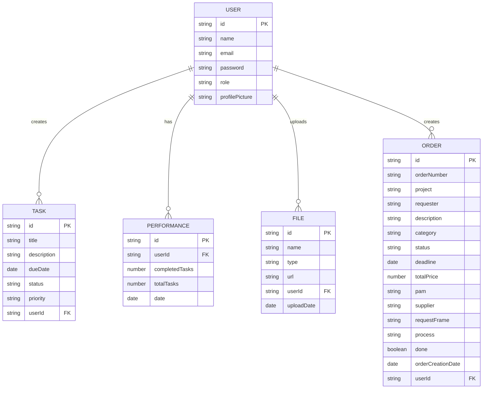
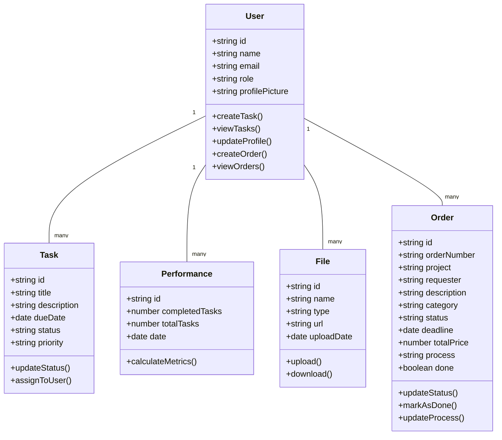
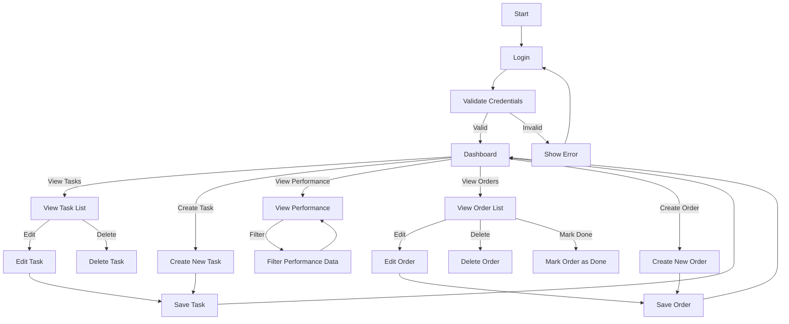
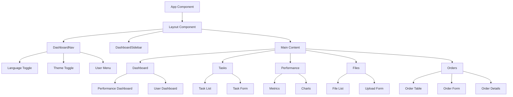
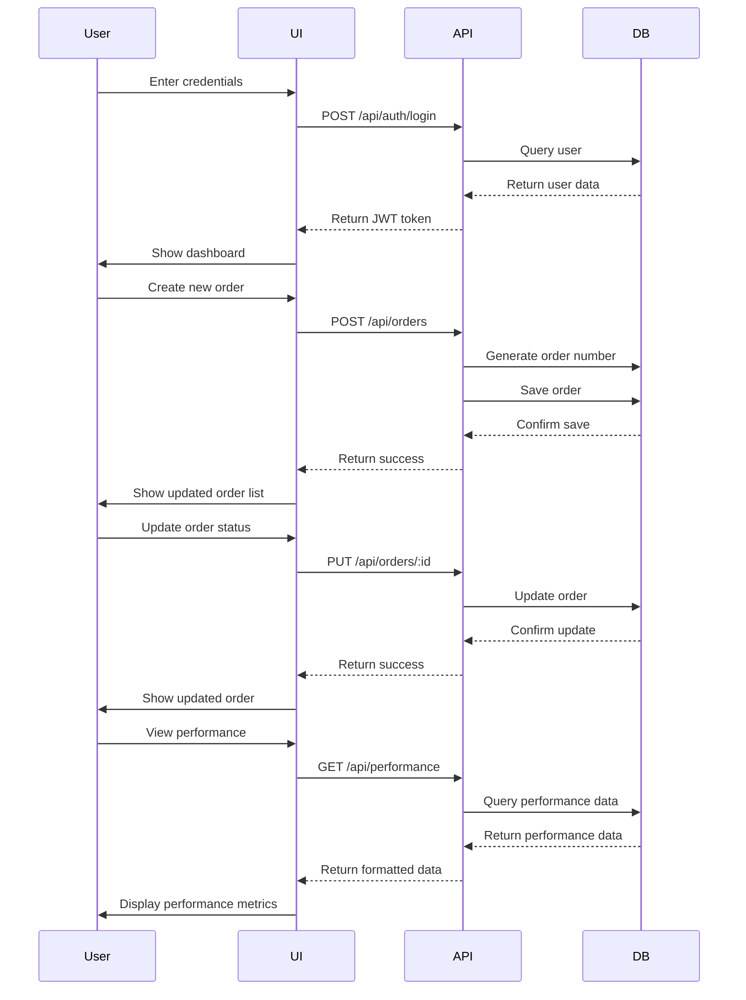
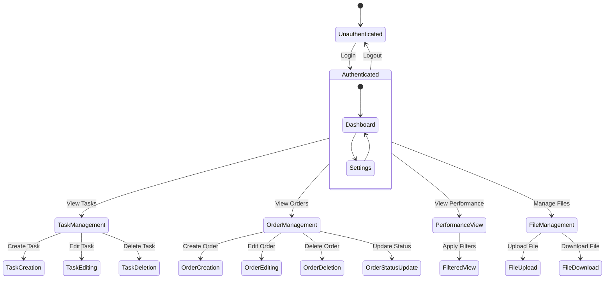
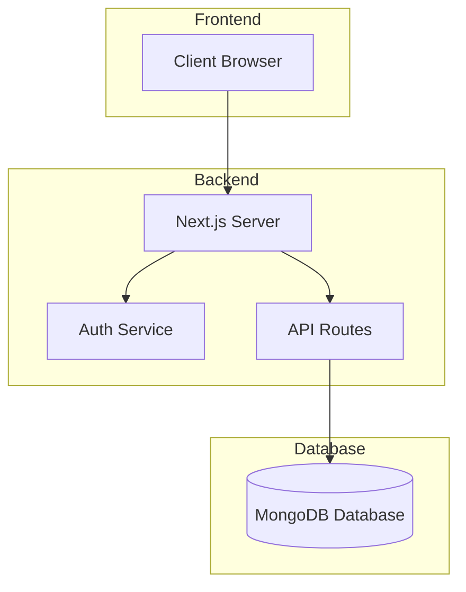
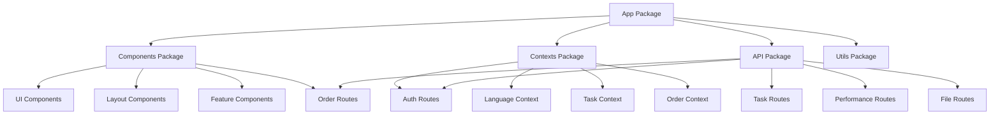
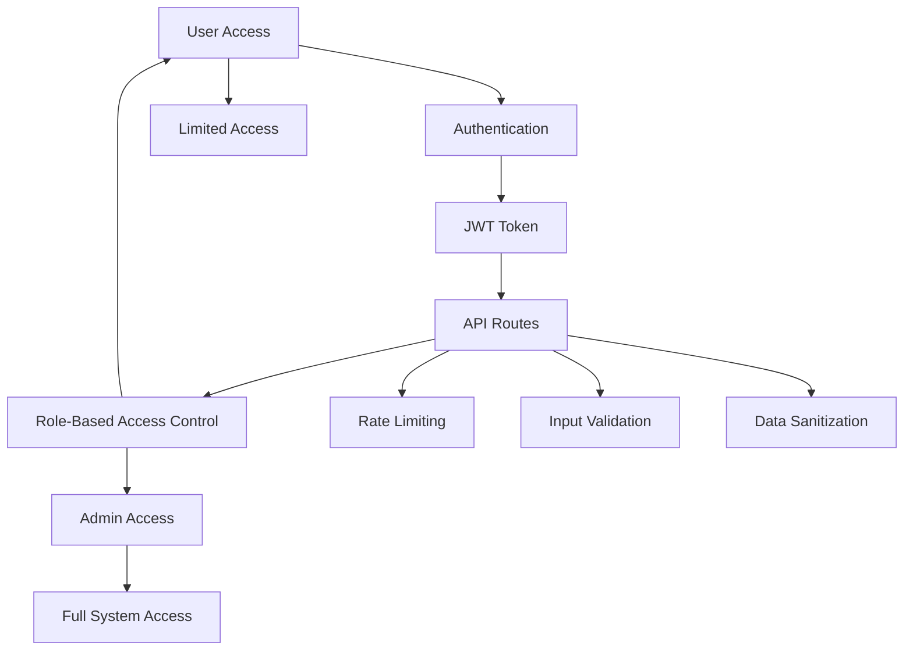

# 🧠 Productivity App – System Documentation

This document provides a comprehensive overview of the technologies used and a series of technical diagrams to illustrate the architecture, flow, and structure of the application.

---

## 🛠 Technologies and Frameworks Used

### 🔹 Frontend

- **Next.js** (React framework)
- **TypeScript**
- **Tailwind CSS** for styling
- **Shadcn/ui** for UI components

### 🔹 Authentication & Authorization

- **NextAuth.js**
- **JWT (JSON Web Tokens)**
- **MongoDB** for user data

### 🔹 State Management

- **React Context API**
- **Custom hooks** (language and task context)

### 🔹 UI Components

- **Lucide React** for icons
- **Radix UI** for accessibility
- **Toast notifications system**

### 🔹 Database

- **MongoDB**
- **Mongoose** for object modeling

### 🔹 API

- **Next.js API Routes**
- RESTful API Design

### 🔹 Internationalization

- **Custom language context**
- Support for English and French

### 🔹 Styling

- **Tailwind CSS**
- **CSS Modules**
- **Responsive Design**

---

## 📊 System Diagrams

### ✅ Use Case Diagram

```mermaid
graph TD
    User[User] --> Login[Login to System]
    User --> ViewTasks[View Tasks]
    User --> ManageTasks[Manage Tasks]
    User --> ViewPerformance[View Performance]
    User --> ManageFiles[Manage Files]
    User --> ViewOrders[View Orders]
    User --> ManageOrders[Manage Orders]

    Admin[Administrator] --> ManageUsers[Manage Users]
    Admin --> ViewAllTasks[View All Tasks]
    Admin --> ViewAllPerformance[View All Performance]
    Admin --> ManageSystem[Manage System Settings]
    Admin --> ViewAllOrders[View All Orders]
    Admin --> ManageAllOrders[Manage All Orders]

    Login --> Authentication[Authentication System]
    ManageTasks --> TaskManagement[Task Management System]
    ViewPerformance --> PerformanceTracking[Performance Tracking System]
    ManageFiles --> FileManagement[File Management System]
    ManageUsers --> UserManagement[User Management System]
    ManageOrders --> OrderManagement[Order Management System]
```

---

### 🔗 Entity-Relationship Diagram (ERD)

---

### 🧱 Class Diagram

---

### 🔁 Activity Diagram

---

### 🧩 Component Diagram

---

### 📦 Sequence Diagram

---

## 🧭 Additional System Diagrams

### 🔄 State Diagram

---

### 🌍 Deployment Diagram

---

### 📦 Package Diagram

---

### 🔐 Security Diagram

---

## 📥 Contribution

Want to contribute or suggest a diagram enhancement? Feel free to open an issue or pull request.

---

Would you like this in a downloadable `.md` file format or directly added to your project repository?
